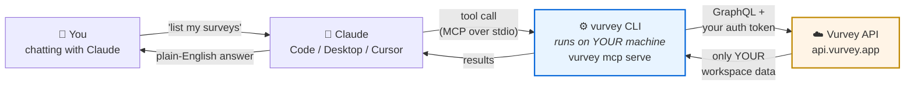
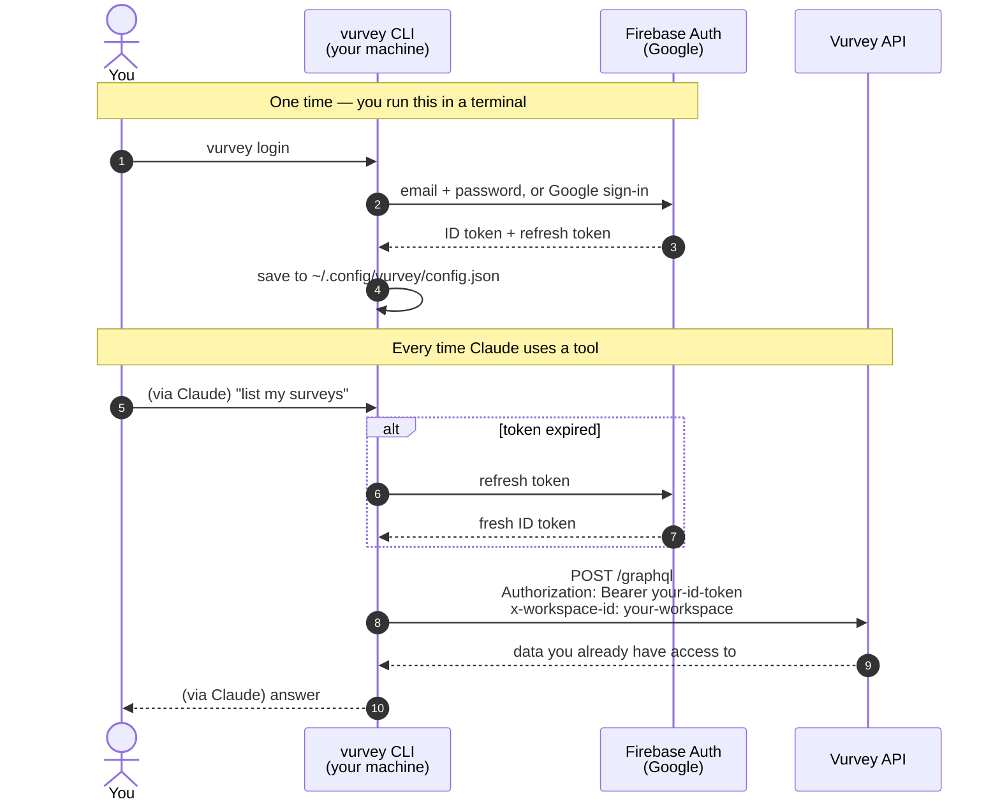

# Vurvey Claude Plugin

Ask Claude about your Vurvey workspace in plain English.

> *"What surveys do we have open?"*
> *"Search our answers for anything about onboarding and summarize the sentiment."*
> *"Show me market share for Acme."*

Works with **Claude Code**, **Claude Desktop**, **Cursor**, **Codex CLI**, and any MCP client.

---

## How it works

Three pieces. The important thing to understand is that **your Vurvey login stays on your own machine** — Claude never sees your password, and Anthropic never receives your Vurvey token.



**This plugin is the wiring, not the engine.** It tells Claude *how to start* the `vurvey` CLI and *when to use* which tool. The CLI does the actual work. That is why you must install the CLI separately — see [Install](#install).

### Where your login lives

You log in once in your terminal. The CLI stores a Firebase token on disk and refreshes it automatically. Every tool call reuses that token.



**What this means in practice:**

| Question | Answer |
|---|---|
| Does Claude see my password? | No. You type it into the CLI in your own terminal. |
| Does my Vurvey token get sent to Anthropic? | No. It goes from your machine straight to the Vurvey API. |
| Can Claude see data I can't? | No. The API applies the same permissions as your account and workspace. |
| Can Claude change things? | Yes — creating and updating are enabled so you can work without the web UI. Deleting is off unless you turn it on. See [What Claude can change](#what-claude-can-change). |
| Do I need a Vurvey account? | Yes. This works against *your* workspace, so you need access to one. |

---

## Install

Two steps. Step 1 is the part people miss.

### 1. Install the CLI and log in

```bash
brew install Batterii/vurvey/vurvey
vurvey login
```

Check it worked before moving on:

```bash
vurvey --version   # need v0.8.0 or newer
vurvey me          # should print your account
```

If `vurvey me` fails, Claude will fail the same way — fix this first. Not a Homebrew user? The install script, APT, RPM, Scoop, and direct-download options are in [`docs/install.md`](docs/install.md#1-install-the-cli-binary).

### 2. Connect it to your assistant

**Claude Code:**

```
/plugin marketplace add Batterii/vurvey-claude-plugin
/plugin install vurvey
```

Then run `/mcp` — you should see `vurvey` connected. Or run `/vurvey-login` and Claude will check your auth for you.

**Claude Desktop, Cursor, Codex** — the CLI writes the config for you:

```bash
vurvey mcp install claude-desktop    # or: cursor | codex | all
```

Restart the app afterward. This finds the right config file, uses an absolute path to the binary (GUI apps often can't see your shell's `$PATH`), and leaves any other MCP servers you have alone.

Per-client detail, multi-profile setups, and troubleshooting: [`docs/install.md`](docs/install.md).

---

## What you can ask

84 tools covering surveys, responses, workflows, capabilities, personas, brands, and chat — plus an escape hatch to every other `vurvey` CLI command. You don't need to know any tool names. Just ask.

**Explore**
- *"What's in my Vurvey workspace?"* — one call gets you the whole picture
- *"What surveys are open right now?"*
- *"What personas do we have, and who's on each?"*

**Analyze**
- *"Pull the responses to our Q1 research survey and summarize the main themes."*
- *"Search all our answers for mentions of 'pricing' and tell me the sentiment."*
- *"Compare response counts across my three most recent surveys."*

**Get work done** (no web UI needed)
- *"Run the weekly insights workflow and tell me when it finishes."*
- *"Create a workflow from the competitive-analysis template."*
- *"Switch me to the Acme workspace."*
- *"Add these five people as contacts."*
- *"Set the brand-tracking capability to run every Monday."*

**Debug**
- *"Why isn't the weekly insights workflow producing output?"*
- *"Where did this chat answer get its sources from?"*

### The escape hatch

If no dedicated tool fits, Claude can call any `vurvey` CLI command directly through the `vurvey_cli` tool — billing, contacts, segments, training sets, people models, rewards, templates, transcripts, and the rest. So *"show me our billing status"* or *"list the segments in this workspace"* works even though there's no purpose-built tool for either.

Claude discovers what's available the same way you would, by asking the CLI for `--help`.

<details>
<summary>Full tool list (84)</summary>

**Read**

| Group | Tools |
|---|---|
| Workspace | `workspace_overview`, `workspace_info`, `workspaces_list`, `whoami`, `environment_get`, `environments_list`, `cli` |
| Surveys | `surveys_list`, `surveys_get`, `surveys_find_by_name` |
| Questions | `questions_list`, `questions_get` |
| Answers | `answers_list`, `answers_get`, `answers_search` |
| Responses | `responses_list`, `responses_get`, `responses_export` |
| Workflows | `workflows_list`, `workflows_get`, `workflows_status`, `workflows_history`, `workflows_history_entry` |
| Workflow config | `workflow_templates_list/get`, `workflow_schedules_list/get`, `workflow_triggers_list/get`, `workflow_variables_list` |
| Capabilities | `capabilities_list`, `capabilities_get`, `capabilities_pipeline_progress`, `capability_blueprints_list/get` |
| Personas | `personas_list`, `personas_get`, `personas_members` |
| Brands | `brands_list`, `brands_get`, `brands_insights`, `brands_market_share` |
| Chat | `chat_list`, `chat_get`, `chat_message_grounding`, `chat_export_markdown` |
| Media | `clips_list`, `clips_get`, `files_get`, `file_tags_list` |
| GraphQL | `graphql_query` — queries always; mutations at `advanced`; delete-pattern mutations only at `destructive` |

**Write** (enabled by default)

| Group | Tools |
|---|---|
| Workflows | `workflows_create`, `workflows_create_auto`, `workflows_create_from_template`, `workflows_update`, `workflows_run`, `workflows_pause`, `workflows_resume`, `workflows_cancel`, `workflows_duplicate`, `workflows_clone_from_history` |
| Workflow reports | `workflows_report_regenerate`, `workflows_report_update`, `workflows_report_share` |
| Workflow config | `workflow_schedules_create/delete`, `workflow_triggers_add/update/remove`, `workflow_variables_create/activate/delete` |
| Capabilities | `capabilities_create`, `capabilities_update`, `capabilities_activate`, `capabilities_quick_start`, `capabilities_deploy_from_blueprint`, `capabilities_add_workflow`, `capabilities_remove_workflow`, `capabilities_run_workflow`, `capabilities_set_schedule` |
| Chat | `chat_send` |
| Context | `workspace_switch`, `environment_switch` |

All names are prefixed `vurvey_`. `graphql_introspect` appears only against environments that allow introspection — production disables it, so its absence there is expected.

</details>

---

## What Claude can change

The plugin ships at the **advanced** tier so you can actually run your workspace from chat instead of switching to the web app. Reading and writing are on; deleting is not.

| Tier | What you get | Setting |
|---|---|---|
| core | 51 tools. Read-only — Claude can look, never touch. | `VURVEY_MCP_TIER=core` |
| **advanced** *(default here)* | 84 tools. Everything above, plus create, update, run, schedule, and switch. | nothing to do |
| destructive | Also allows deleting: workspaces, surveys, contacts, subscriptions. | add `VURVEY_MCP_ALLOW_DESTRUCTIVE=1` |

**Why deletes are off.** Everything at `advanced` is recoverable — a workflow you didn't want can be paused, an edit can be re-edited. Deletes aren't. Since Claude is acting on an interpretation of what you asked, the one class of mistake worth a speed bump is the irreversible one. Turn it on if you need it; it's one line.

**What still protects you at `advanced`:** your client asks permission before every single tool call, and the API enforces your own account permissions — Claude cannot reach anything you couldn't reach yourself. Read the tool call before approving it, the same way you'd read a command before pasting it into a terminal.

To change tiers, edit `env` in the plugin's `mcp.json`:

```json
{
  "mcpServers": {
    "vurvey": {
      "command": "vurvey",
      "args": ["mcp", "serve"],
      "env": { "VURVEY_MCP_TIER": "advanced" }
    }
  }
}
```

---

## Troubleshooting

| What you see | What's wrong | Fix |
|---|---|---|
| Plugin installed, but no Vurvey tools | The CLI isn't installed — the plugin doesn't ship it | `which vurvey` is empty → do [step 1](#1-install-the-cli-and-log-in) |
| *"not authenticated"* on every call | No valid token | `vurvey login`, then `/mcp restart vurvey` |
| *"Command not found: vurvey"* | Installed, but your client can't see it | Use an absolute path in the config: `/opt/homebrew/bin/vurvey` |
| Server seems hung | — | Check `~/.config/vurvey/mcp.log`; stdout is reserved for protocol traffic |
| *"refusing to start against non-Vurvey host"* | `api_url` isn't a Vurvey domain | Check `~/.config/vurvey/config.json` |
| Claude refused to delete something | Deletes are off by default | See [What Claude can change](#what-claude-can-change) |

---

## Working across environments

If you use both staging and production, set up one profile each:

```bash
vurvey login --profile staging
vurvey login --profile prod
```

Then add one MCP server entry per profile. Config snippets per client: [`docs/install.md`](docs/install.md).

---

## Requirements

- `vurvey` CLI v0.8.0+ on `$PATH` (v0.17.x for the full 84-tool surface)
- A Vurvey account and workspace — [vurvey.com](https://vurvey.com)

## Contributing

Issues and PRs welcome here. The MCP server source lives in `Batterii/vurvey-cli` (private — Vurvey staff and collaborators).

## License

MIT — see [LICENSE](LICENSE).
