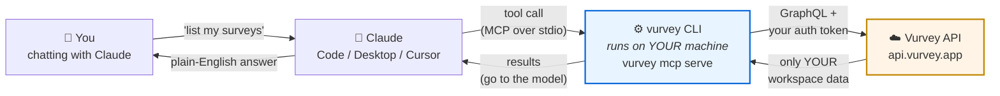
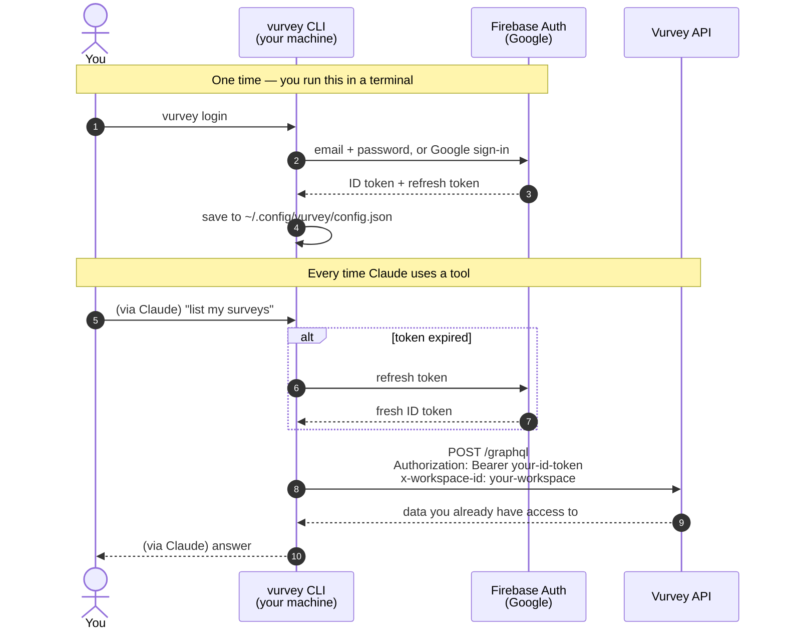

# Vurvey Claude Plugin

Ask Claude about your Vurvey workspace in plain English.

> *"What surveys do we have open?"*
> *"Search our answers for anything about onboarding and summarize the sentiment."*
> *"Show me market share for Acme."*

Works with **Claude Code**, **Claude Desktop**, **Cursor**, **Codex CLI**, and any MCP client.

---

## How it works

Three pieces, and two things to understand about what moves where.

**Your Vurvey login stays on your own machine.** Claude never sees your password, and no tool built for reading your workspace sends your Vurvey token anywhere but the Vurvey API. There is one exception, and it is the `vurvey_cli` escape hatch: see [What the read-only tier does and does not stop](#what-the-read-only-tier-does-and-does-not-stop).

**Your Vurvey data does not stay on your machine.** Whatever a tool returns is inserted into the conversation and sent to the model provider, the same as text you paste in yourself. That is how Claude answers from it.


```mermaid
flowchart LR
    You["👤 You<br/>chatting with Claude"]
    Claude["🤖 Claude<br/>Code / Desktop / Cursor"]
    CLI["⚙️ vurvey CLI<br/><i>runs on YOUR machine</i><br/>vurvey mcp serve"]
    API["☁️ Vurvey API<br/>api.vurvey.app"]

    You -->|"'list my surveys'"| Claude
    Claude -->|"tool call<br/>(MCP over stdio)"| CLI
    CLI -->|"GraphQL +<br/>your auth token"| API
    API -->|"only YOUR<br/>workspace data"| CLI
    CLI -->|"results<br/>(go to the model)"| Claude
    Claude -->|"plain-English answer"| You

    style CLI fill:#e8f4ff,stroke:#0969da,stroke-width:2px
    style API fill:#fff4e6,stroke:#bf8700,stroke-width:2px
```

**This plugin is the wiring, not the engine.** It tells Claude *how to start* the `vurvey` CLI and *when to use* which tool. The CLI does the actual work. That is why you must install the CLI separately — see [Install](#install).

### Where your login lives

You log in once in your terminal. The CLI stores a Firebase token on disk and refreshes it automatically. Every tool call reuses that token.


```mermaid
sequenceDiagram
    autonumber
    actor You
    participant CLI as vurvey CLI<br/>(your machine)
    participant FB as Firebase Auth<br/>(Google)
    participant API as Vurvey API

    Note over You,FB: One time — you run this in a terminal
    You->>CLI: vurvey login
    CLI->>FB: email + password, or Google sign-in
    FB-->>CLI: ID token + refresh token
    CLI->>CLI: save to ~/.config/vurvey/config.json

    Note over You,API: Every time Claude uses a tool
    You->>CLI: (via Claude) "list my surveys"
    alt token expired
        CLI->>FB: refresh token
        FB-->>CLI: fresh ID token
    end
    CLI->>API: POST /graphql<br/>Authorization: Bearer your-id-token<br/>x-workspace-id: your-workspace
    API-->>CLI: data you already have access to
    CLI-->>You: (via Claude) answer
```

**What this means in practice:**

| Question | Answer |
|---|---|
| Does Claude see my password? | No. You type it into the CLI in your own terminal. |
| Does my Vurvey token get sent to Anthropic? | Not by any tool built for reading your workspace. Those send it to the Vurvey API. `vurvey_docs_search` / `vurvey_docs_get` send it to a second host, the Vurvey documentation service, and on v0.19.2 and earlier a `VURVEY_DOCS_URL` in the server's environment redirects that request with no host check. The `vurvey_cli` escape hatch can also print the token into the transcript, which does reach the model provider: see [What the read-only tier does and does not stop](#what-the-read-only-tier-does-and-does-not-stop). |
| Can Claude see data I can't? | No. The API applies the same permissions as your account and workspace. |
| Does my workspace data get sent to Anthropic? | Yes. Every tool result is added to the conversation, so whatever a tool returns goes to the model provider along with the rest of the chat. |
| What is in a tool result? | Whatever was asked for, verbatim. Respondent free text (`vurvey_answers_*`), workspace member names and email addresses (`vurvey_personas_members`), and anything your account can read through `vurvey_graphql_query`. Treat a tool call the way you would treat pasting that data into chat. |
| Can Claude change things? | Not through any tool built for it. The write and delete tools are not registered, and GraphQL mutations are refused. The `vurvey_cli` escape hatch is the gap, and it is a real one on released CLIs: see [What the read-only tier does and does not stop](#what-the-read-only-tier-does-and-does-not-stop). |
| Do I need a Vurvey account? | Yes. This works against *your* workspace, so you need access to one. |

---

## Install

Two steps. Step 1 is the part people miss.

### 1. Install the CLI, log in, and pick a workspace

```bash
brew install Batterii/vurvey/vurvey
vurvey login
vurvey workspaces list       # find the workspace you want
vurvey workspaces use <id>   # select it
```

**Do not skip the last command.** `vurvey login` does not select a workspace, and until one is selected every workspace-scoped question fails with `Variable "$workspaceId" got invalid value ""`. The error text blames the tool rather than the missing selection, so it is easy to misread as a bug. Claude cannot run this for you on the tier this plugin ships.

Check it worked before moving on:

```bash
vurvey --version               # need v0.19.1 or newer
vurvey me                      # should print your account
vurvey surveys list --limit 3  # should print surveys, not an error
```

If either of the last two fails, Claude will fail the same way. Fix it first. Not a Homebrew user? The install script, APT, RPM, Scoop, and direct-download options are in [`docs/install.md`](docs/install.md#1-install-the-cli-binary).

### 2. Connect it to your assistant

**Claude Code:**

```
/plugin marketplace add Batterii/vurvey-claude-plugin
/plugin install vurvey
```

Then run `/mcp` — you should see `vurvey` connected. Or run `/vurvey-login` and Claude will check your auth for you.

**Claude Desktop, Cursor, Codex** — the CLI writes the config for you:

```bash
vurvey mcp install claude-desktop --read-only    # or: cursor | codex | all
```

Restart the app afterward. This finds the right config file, uses an absolute path to the binary (GUI apps often can't see your shell's `$PATH`), and leaves any other MCP servers you have alone. `--read-only` is what gives those clients the same posture the plugin ships; without it they run at the CLI's default `advanced` tier, which allows writes.

Per-client detail, multi-profile setups, and troubleshooting: [`docs/install.md`](docs/install.md).

---

## Staying up to date

There are two moving parts, and they update separately.

| | What it is | How to update |
|---|---|---|
| **CLI** | The binary that does the work. New *tools* ship here. | `vurvey update` (or `brew upgrade vurvey`) |
| **Plugin** | The wiring and the skill. | `/plugin update vurvey` |

**Run `/vurvey-update` any time** and Claude will check both, compare them against what's published, and tell you exactly what to run. If both are current it says so and stops.

### Turn on auto-update for the plugin

Add this to `~/.claude/settings.json`. It registers the marketplace *and* keeps it current, so you can skip `/plugin marketplace add` entirely:

```json
{
  "extraKnownMarketplaces": {
    "vurvey": {
      "source": { "source": "github", "repo": "Batterii/vurvey-claude-plugin" },
      "autoUpdate": true
    }
  }
}
```

This covers the plugin only. The CLI binary still updates on its own schedule. If a *read* tool Claude expects is missing, the CLI is almost always what's behind, since tools ship in CLI releases rather than plugin releases. A missing *write* tool is the tier, not the version: see [What Claude can change](#what-claude-can-change).

> Updating the plugin without refreshing the marketplace first can report "already up to date" when it isn't. `/plugin marketplace update Batterii/vurvey-claude-plugin` then `/plugin update vurvey`, or just let auto-update handle it.

---

## What you can ask

53 read-only tools as shipped, 82 once writes are turned on, covering surveys, responses, workflows, capabilities, personas, brands, and chat, plus an escape hatch to every other `vurvey` CLI command. You don't need to know any tool names. Just ask.

**Explore**
- *"What's in my Vurvey workspace?"* — one call gets you the whole picture
- *"What surveys are open right now?"*
- *"What personas do we have, and who's on each?"*

**Analyze**
- *"Pull the responses to our Q1 research survey and summarize the main themes."*
- *"Search all our answers for mentions of 'pricing' and tell me the sentiment."*
- *"Compare response counts across my three most recent surveys."*

**Get work done** (none of these work as shipped, they need the `advanced` tier: see [What Claude can change](#what-claude-can-change))
- *"Run the weekly insights workflow and tell me when it finishes."*
- *"Create a workflow from the competitive-analysis template."*
- *"Switch me to the Acme workspace."* (read-only alternative: switch in a terminal with `vurvey workspaces use <id>`, then `/mcp restart vurvey`)
- *"Add these five people as contacts."*
- *"Set the brand-tracking capability to run every Monday."*

**Debug**
- *"Why isn't the weekly insights workflow producing output?"*
- *"Where did this chat answer get its sources from?"*

### The escape hatch

If no dedicated tool fits, Claude can call any `vurvey` CLI command directly through the `vurvey_cli` tool — billing, contacts, segments, training sets, people models, rewards, templates, transcripts, and the rest. So *"show me our billing status"* or *"list the segments in this workspace"* works even though there's no purpose-built tool for either.

Claude discovers what's available the same way you would, by asking the CLI for `--help`.

The escape hatch is meant to run read commands only, and it refuses an ordinary write with *"non-read command requires advanced tier"*. Its read/write split is a heuristic rather than a gate, though, and on releases through v0.19.2 there are argument shapes that get past it. Read [What the read-only tier does and does not stop](#what-the-read-only-tier-does-and-does-not-stop) before you treat it as a boundary.

<details>
<summary>Full tool list</summary>

**Read**

| Group | Tools |
|---|---|
| Workspace | `workspace_overview`, `workspace_info`, `workspaces_list`, `whoami`, `environment_get`, `environments_list` |
| Surveys | `surveys_list`, `surveys_get`, `surveys_find_by_name` |
| Questions | `questions_list`, `questions_get` |
| Answers | `answers_list`, `answers_get`, `answers_search` |
| Responses | `responses_list`, `responses_get`, `responses_export` |
| Workflows | `workflows_list`, `workflows_get`, `workflows_status`, `workflows_history`, `workflows_history_entry` |
| Workflow config | `workflow_templates_list/get`, `workflow_schedules_list/get`, `workflow_triggers_list/get`, `workflow_variables_list` |
| Capabilities | `capabilities_list`, `capabilities_get`, `capabilities_pipeline_progress`, `capability_blueprints_list/get` |
| Personas | `personas_list`, `personas_get`, `personas_members` |
| Brands | `brands_list`, `brands_get`, `brands_insights`, `brands_market_share` |
| Chat | `chat_list`, `chat_get`, `chat_message_grounding`, `chat_export_markdown` |
| Media | `clips_list`, `clips_get`, `files_get`, `file_tags_list` |
| Engineering docs | `docs_search`, `docs_get` (staff-only, and enforced by the docs service, not the CLI: a customer's valid token reaches it and is refused) |
| GraphQL | `graphql_query` (queries at every tier; mutations at `advanced`; delete-pattern mutations only at `destructive`), `graphql_introspect` |
| Escape hatch | `cli` (any `vurvey` CLI subcommand). Registered here, but **not** a read-only tool: see [What the read-only tier does and does not stop](#what-the-read-only-tier-does-and-does-not-stop). |

**Write** (not shipped on; requires `VURVEY_MCP_TIER=advanced`)

| Group | Tools |
|---|---|
| Workflows | `workflows_create`, `workflows_create_auto`, `workflows_create_from_template`, `workflows_update`, `workflows_run`, `workflows_pause`, `workflows_resume`, `workflows_cancel`, `workflows_duplicate`, `workflows_clone_from_history` |
| Workflow reports | `workflows_report_regenerate`, `workflows_report_update`, `workflows_report_share` |
| Workflow config | `workflow_schedules_create`, `workflow_triggers_add/update`, `workflow_variables_create/activate` |
| Capabilities | `capabilities_create`, `capabilities_update`, `capabilities_activate`, `capabilities_quick_start`, `capabilities_deploy_from_blueprint`, `capabilities_add_workflow`, `capabilities_run_workflow`, `capabilities_set_schedule` |
| Chat | `chat_send` |
| Context | `workspace_switch`, `environment_switch` |

**Delete** (requires `VURVEY_MCP_ALLOW_DESTRUCTIVE=1` on top of `advanced`)

| Group | Tools |
|---|---|
| Workflow config | `workflow_schedules_delete`, `workflow_triggers_remove`, `workflow_variables_delete` |
| Capabilities | `capabilities_remove_workflow` |

These four were registered at `advanced` on CLI releases before v0.19.1, so the delete opt-in gated nothing for them. That is why the minimum version below is what it is.

All names are prefixed `vurvey_`. `graphql_introspect` registers only against an API that allows introspection, which no hosted Vurvey environment does, so it is absent in normal use. That is why the read count is 53 rather than the 54 names listed here.

</details>

---

## What Claude can change

The plugin ships at the **core** tier, pinned read-only. Writing and deleting are both opt-in, and you are the one who turns them on.

| Tier | What you get | Setting |
|---|---|---|
| **core** *(what this plugin ships)* | 53 tools. No write or delete tool is registered, and GraphQL mutations are refused. | nothing to do |
| advanced | 82 tools. Everything above, plus create, update, run, schedule, and switch. | `VURVEY_MCP_TIER=advanced` |
| destructive | 86 tools. Also registers the four delete tools and allows `deleteX` GraphQL mutations. | `advanced` plus `VURVEY_MCP_ALLOW_DESTRUCTIVE=1` |

Counts measured against `vurvey` v0.19.2 by sending `tools/list` to `vurvey mcp serve`.

They can each read one higher, 54 / 83 / 87, when `vurvey_graphql_introspect` registers. Two situations do that, and neither is a hosted environment: an API run locally with `NODE_ENV=development`, which is the only setting under which Apollo enables introspection, and a server started before you have logged in, because the startup probe registers the tool when it cannot run. Production, staging, and experimental all disable introspection.

**`advanced` is the CLI's own default, so this pin is the only thing making the plugin read-only.** A client wired up with a bare `vurvey mcp install` (Claude Desktop, Cursor, Codex) gets no `env` block and therefore runs at `advanced`. Pass `--read-only` to get the same posture there:

```bash
vurvey mcp install claude-desktop --read-only
```

**Why deletes are off.** Everything at `advanced` is recoverable — a workflow you didn't want can be paused, an edit can be re-edited. Deletes aren't. Since Claude is acting on an interpretation of what you asked, the one class of mistake worth a speed bump is the irreversible one. Turn it on if you need it; it's one line.

### What the read-only tier does and does not stop

Read this before you rely on `core` as a boundary. It is measured against v0.19.2, the current release.

**What it does stop, and does so by construction:**

- The write tools and the four delete tools are not registered. They are absent from `tools/list`, so there is nothing for the model to call.
- `vurvey_graphql_query` refuses any document whose first operation keyword is `mutation`.
- With `VURVEY_MCP_READ_ONLY=1` pinned alongside the tier, both of those hold even if the tier value is wrong.

**What it does not stop.** `vurvey_cli` is registered at `core`, and its read-versus-write decision is a heuristic over the argument list rather than a gate. Running the released classifier directly, every one of these is allowed at `core`:

```
["surveys", "create", "--name", "list"]                   -> allowed
["workflows", "run", "--id", "list"]                      -> allowed
["workspaces", "create", "--name", "help"]                -> allowed
["config", "get", "token", "--reveal"]                    -> allowed
["--api-url", "https://example.com", "surveys", "list"]   -> allowed
```

Three separate causes. The classifier scans every token for a read verb and stops at the first match, so a read verb sitting in a flag **value** launders a mutation. A `help` token anywhere returns allowed before the blocklist and both tier checks run. And the subcommand is identified as the first token not starting with `-`, so a leading `--api-url` is read as the subcommand and points the subprocess at another host while it still carries your session bearer token. `config get token --reveal` classifies as a read and prints your auth and refresh tokens, which then become a tool result and go to the model provider like any other.

`VURVEY_MCP_READ_ONLY=1` does not close this. It gates tool **registration** by tier, and `vurvey_cli` is a core tool, so it stays registered and the classifier stays in charge.

This matters more, not less, because respondent free text reaches the model (see the table at the top). Text in your survey data that tries to steer the assistant is reaching one that has been told this tool cannot write.

**So the real boundary at `core` is your own account's permissions on the Vurvey API,** plus the fact that nothing here is trying to get past the classifier. Treat "read-only" as the shape of the tool surface, not as a guarantee about the subprocess. The CLI fix that stops registering `vurvey_cli` unless `VURVEY_MCP_UNSAFE_LOCAL=1` is on the CLI's main branch and is not in any release yet; this section comes out when it ships.

**What changes at `advanced`.** The write tools register and mutations are allowed, so the tool surface stops being the constraint at all and you are relying on your client's approval prompt.

**Do not lean on that prompt.** Clients do prompt before a tool call by default, but ordinary settings switch it off, and then a write happens with no confirmation:

- a permission rule that allowlists the Vurvey tools. Installed as a plugin they are namespaced `mcp__plugin_vurvey_vurvey__*`; added by hand as a server named `vurvey` they are `mcp__vurvey__*`.
- `"defaultMode": "bypassPermissions"` in Claude Code settings
- launching Claude Code with `--dangerously-skip-permissions`
- the equivalent auto-run mode in another MCP client, such as Cursor's auto-run or Codex `approval_policy = "never"`

`acceptEdits` is **not** one of these. It auto-accepts file edits and still prompts for MCP tool calls.

If you run `advanced` with any of those four in effect, read the tier as "Claude may write to my Vurvey workspace without asking me first."

To turn writes on, edit `env` in the plugin's `mcp.json`:

```json
{
  "mcpServers": {
    "vurvey": {
      "command": "vurvey",
      "args": ["mcp", "serve"],
      "env": { "VURVEY_MCP_TIER": "advanced" }
    }
  }
}
```

---

## Troubleshooting

Ask Claude first. It has a diagnostic playbook in its bundled skill and will walk you through this one step at a time. `/vurvey-update` checks whether the CLI and plugin are current, which is the cause often enough to be worth ruling out first.

### Quick reference

| What you see | What's wrong | Fix |
|---|---|---|
| Plugin installed, but no Vurvey tools at all | The CLI isn't installed, and the plugin doesn't ship it | `which vurvey` empty → [step 1](#1-install-the-cli-log-in-and-pick-a-workspace) |
| `/mcp` doesn't list `vurvey` | Plugin components didn't load | [Reinstall the plugin](#reinstalling-the-plugin) |
| A tool this README documents doesn't exist | CLI is behind — tools ship in CLI releases | `vurvey update`, then `/mcp restart vurvey` |
| *"not authenticated"* on every call | No valid token | `vurvey login`, then `/mcp restart vurvey` |
| *"Command not found: vurvey"* | Installed, but the client can't see it on `$PATH` | Use an absolute path: `/opt/homebrew/bin/vurvey` |
| **`Access denied: Invalid or expired auth token`** | Signed in against the wrong environment | `vurvey update` — see [below](#access-denied-invalid-or-expired-auth-token) |
| Server seems hung | — | `~/.config/vurvey/mcp.log`; stdout is protocol traffic only |
| *"refusing to start against non-Vurvey host"* | `api_url` isn't a Vurvey domain | `vurvey config get api-url` |
| `vurvey_graphql_introspect` missing | Every hosted environment disables introspection | Working as intended |
| `Variable "$workspaceId" got invalid value ""` | No workspace selected. The message blames the tool, but nothing is wrong with it | `vurvey workspaces list`, `vurvey workspaces use <id>`, then `/mcp restart vurvey` |
| A write tool is missing, or *"requires advanced tier"* | The plugin ships read-only | [What Claude can change](#what-claude-can-change) |
| Claude refused to delete something | Deletes are off by default | [What Claude can change](#what-claude-can-change) |

### Reinstalling the plugin

A plain `/plugin install` is **not** sufficient. The marketplace listing is cached locally, so reinstalling can pull the same stale copy that caused the problem. Remove and re-add the marketplace:

```
/plugin marketplace remove vurvey
/plugin marketplace add Batterii/vurvey-claude-plugin
/plugin install vurvey
```

Then **start a new Claude Code session** — MCP servers connect at session start, so a newly installed server won't appear in your current one. `/reload-plugins` does not reconnect MCP servers. Confirm with `/mcp`.

### `Access denied: Invalid or expired auth token`

Nothing is expired. This means a token from one environment was presented to another, and the API rejected it on the signing key. The giveaway is that the login itself reported success immediately before the failure.

It was caused by a bug in CLI versions before the fix: logging in with a `--api-url` override authenticated against the environment in the stored config (production by default on a fresh install) rather than the one being targeted. It bit hardest on first login with an isolated `XDG_CONFIG_HOME`, since that's exactly when no `api_url` is stored yet.

```bash
vurvey update
```

On an older binary, set the environment *before* logging in rather than during, which avoids the bug entirely:

```bash
vurvey login --profile staging
vurvey --profile staging config set api-url https://api-staging.vurvey.dev
```

---

## Working across environments

Production, staging, and experimental are separate systems with separate accounts and separate data. An account in one does not exist in the others.

| Environment | API URL |
|---|---|
| production | `https://api.vurvey.app` |
| staging | `https://api-staging.vurvey.dev` |
| experimental | `https://api-experimental.vurvey.dev` |

Set up one profile per environment:

```bash
vurvey login --profile staging
vurvey login --profile prod
```

Then ask Claude to switch between them ("switch to the staging environment") — it uses `vurvey_environment_switch`, which changes the active profile for the session. The target profile must already have a completed login, or there is nothing to switch to.

Prefer `--profile` over `--api-url` for anything involving credentials. Profiles keep each environment's URL and token together; `--api-url` only redirects a single command and is not persisted. Config snippets per client: [`docs/install.md`](docs/install.md).

---

## Requirements

- `vurvey` CLI **v0.19.1 or newer** on `$PATH`, and **v0.19.2** is the current release. v0.19.1 is the floor because earlier releases register the four delete tools at the `advanced` tier, so `VURVEY_MCP_ALLOW_DESTRUCTIVE` gated nothing for them and the "deletes are off" promise in these docs was false. Note that v0.19.2 does **not** close the `vurvey_cli` escape hatch described in [What the read-only tier does and does not stop](#what-the-read-only-tier-does-and-does-not-stop), and neither does `VURVEY_MCP_READ_ONLY=1`.
- A Vurvey account and workspace — [vurvey.com](https://vurvey.com)

**Nothing warns you on a version mismatch.** The plugin does not check the binary's version and MCP does not negotiate one, so an older CLI just answers with a different tool set. The symptoms are a tool documented here missing from `/mcp`, or counts that don't match what `/mcp` shows. Run `vurvey --version` in a terminal to see which binary is answering, then `vurvey update` and `/mcp restart vurvey`. Asking Claude will not tell you: through v0.19.2 no tool reports the server's own version, and `vurvey_environment_get` returns only the profile, API URL, environment label, workspace id, and whether a token is present.

**Known gaps at the time of writing.** No released version delivers everything documented here.

- The `vurvey_cli` escape hatch is registered at `core` and its read/write classifier can be defeated by a read verb in a flag value, a `help` token anywhere in the argument list, or a leading `--api-url`. Details and the exact argument shapes are in [What the read-only tier does and does not stop](#what-the-read-only-tier-does-and-does-not-stop). Fixed on the CLI's main branch, unreleased.
- `vurvey_capability_blueprints_list` fails on every release through v0.19.2 with `Variable "$wsId" of type "ID!" used in position expecting type "GUID!"`. Fixed on the CLI's main branch, unreleased.

## Contributing

Issues and PRs welcome here. The MCP server source lives in `Batterii/vurvey-cli` (private — Vurvey staff and collaborators).

## License

MIT — see [LICENSE](LICENSE).
